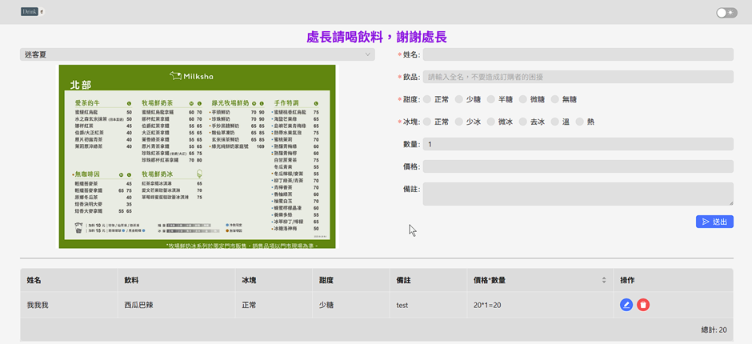
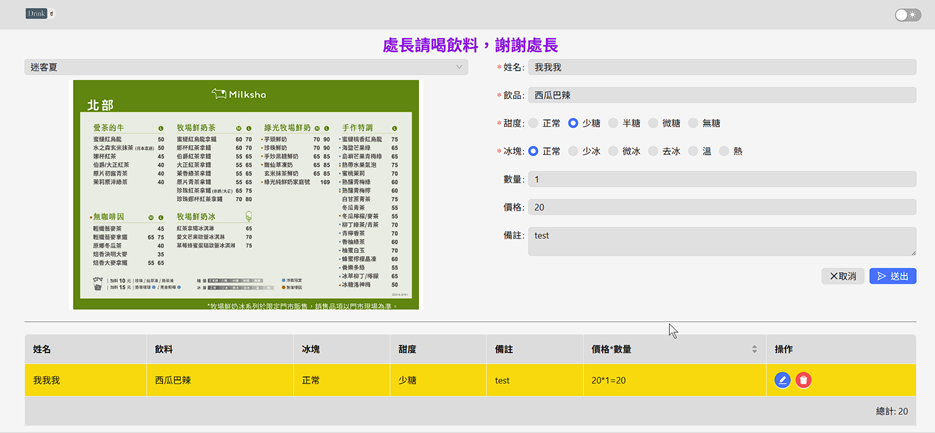

# 訂飲料

說真的，我從來沒想過我會在上班有負責訂飲料的一天，總之就是某天我訂飲料，然後就被臭了ˊ_ˋ。  
原本想說找機會跟老大說，看看給不給用，但某天我裝個開發工具就被臭了，說什麼資安問題，我覺得我裝的工具已經是相對安全了，又不是從甚麼神奇的地放下載，這樣都不行，真的是在哭。  
那我這個自己寫的，也不能放到USB放到公司電腦，也是要從github下載，我想8成又會被臭，想想還是算了，SB公司一輩子用紙筆吧。  
  
由於上班的環境是在工廠，就是一個甚麼都要申請的環境，不然用google excel就可以了，我也不用再寫一個簡陋版的訂飲料了。本網頁只能訂飲料，都只會顯示當天的飲料而已，不支援顯示查詢歷史紀錄，但可以自己去資料庫查，我怕那些請飲料的人看到自己請的次數，和花了這麼多錢請這些~~廢物~~會受不了。

本專案只適合類似公司、工廠那樣，大家都在同一個網路環境下才可以用

## 程式截圖





## 技術

一切都是在本地運行，使用`rethinkDB`是因為它可以監聽資料庫變化，然後用`socket.io`，傳送消息到前端顯示

- 前端: react、ant design
- 消息: zustand、socket.io
- 資料存儲: rethinkDB

## TODO(做不到但又想做的事)

- [x] 自動爬取最新菜單，目前都需要手動更換(部分有官網的店家可以做到)
- [x] 打包成docker(介於可行和不可行之間)
- [ ] 可以跟訂飲料的網站連結，一鍵下訂。
  - 靠杯一下某個訂飲料的網站換個分店而已，訂購資料全都要重打什麼大便，氣氣氣~

## Docker說明

1. pull 專案

```terminal
docker pull gray9527/order-drink-app:latest
```

2. 在任一錄建立 `.env` 檔，以下是範例：

 環境變數說明

| 變數名稱                        | 說明                               |
| --------------------------- | -------------------------------- |
| `RETHINKDB_HOST`            | RethinkDB 服務主機名稱，固定是 `rethinkdb` |
| `REACT_APP_TITLE`           | 訂飲料頁面標題，例如：XX請喝飲料                |
| `REACT_APP_STORE_NAME`      | 預設飲料店名稱，預設載入網頁第一個出現的店家，名稱請參考下方列出的飲料店名稱的                  |
| `REACT_APP_ROOT_IP_ADDRESS` | 本機電腦的IPv4地址                   |

**可用飲料店名稱:** 19 , comebuy , teatop , 五桐號 , 可不可 , 大苑子 , 珍煮丹 , 萬波 , 迷客夏 , 阿義 , 麻古 , 清原 , 花好月圓 , 茶湯會 , 大茗 , 上宇林 , 鮮茶道

```env
REACT_APP_TITLE='XX請喝飲料，謝謝XX'
REACT_APP_STORE_NAME='迷客夏'
REACT_APP_ROOT_IP_ADDRESS='192.168.1.101'
RETHINKDB_HOST='rethinkdb' #這個固定
```

1. 在同一目錄下建立 `docker-compose.yml`，把下面的內容貼上

```yaml
version: "3.9"
services:
  rethinkdb:
    image: rethinkdb:latest
    container_name: rethinkdb
    volumes:
      - ./rethinkdb-data:/data
    ports:
      - "8080:8080"
      - "28015:28015"
    healthcheck:
      test: ["CMD", "curl", "-f", "http://localhost:8080"]  # RethinkDB web UI ready
      interval: 2s
      retries: 20
      start_period: 5s

  app:
    build:
      context: .
      args:
        REACT_APP_TITLE: ${REACT_APP_TITLE}
        REACT_APP_STORE_NAME: ${REACT_APP_STORE_NAME}
        REACT_APP_ROOT_IP_ADDRESS: ${REACT_APP_ROOT_IP_ADDRESS}
    image: gray9527/order-drink-app:latest
    container_name: order-drink-app
    environment:
      # 後端用
      - ROOT_IP_ADDRESS=${REACT_APP_ROOT_IP_ADDRESS}
      - RETHINKDB_HOST=${RETHINKDB_HOST}
      # 前端動態 env 用
      - REACT_APP_TITLE=${REACT_APP_TITLE}
      - REACT_APP_STORE_NAME=${REACT_APP_STORE_NAME}
      - REACT_APP_ROOT_IP_ADDRESS=${REACT_APP_ROOT_IP_ADDRESS}
    ports:
      - "5000:5000"
    depends_on:
      rethinkdb:
        condition: service_healthy
```

4. 執行指令啟動服務：

```bash
docker compose up -d # 這會把服務另開，不會占用當前窗口
docker compose up # 用當前窗口開啟服務
```

5. 用瀏覽器開啟 [http://localhost:5000](http://localhost:5000)
   可以把localhost換成你的ipv4

### 停止服務

```bash
docker compose down # 這會刪除容器
docker compose stop # 這會停止服務
```

## 菜單

### 支援的店家

平常我很少買飲料，不知什麼時候開始有這麼多飲料店...
以`桃園市龍潭區`的飲料店為主，目前的店家有:  

- 19茶屋
- 50嵐
- coco
- comebuy
- teatop
- 一沐日
- 五桐號
- 可不可
- 吾奶王
- 大苑子
- 德正
- 清心
- 烏弄
- 珍煮丹
- 萬波
- 迷客夏
- 阿義
- 鮮茶道
- 麻古
- 龜記
- 清原
- 茶湯會
- 雷的茶
- 蔗家店
- 花好月圓
- 大茗本位製茶堂

### 菜單爬蟲

部分店家可以做到，有些飲料店官網沒有菜單，只能從其他部分取得，不確定那些地方會不會更新，所以就沒有用爬蟲了，特別紀錄那些不能用爬蟲的特殊店家

**`標題就是官網或圖片連結`**

### [50嵐](http://50lan.com/web/news.asp '50嵐')

從官網來看就是古老的飲料店，網頁還有adobe，菜單還是用doc，有夠怪的

### [COCO](https://supertaste.tvbs.com.tw/food/347016 'COCO')

沒有官網，菜單好像只會放在FB，這個連結是某個部落格的

### [德正](https://dejeng.com/ '德正')

官網做得很漂亮，但沒有菜單圖片阿，這樣再漂亮有G8用

### [清心](https://www.chingshin.tw/ '清新')

有官網，但官網沒有菜單圖片

### [鮮茶道](https://www.chingshin.tw/ '鮮茶道')

有官網，也有圖片，但我不知道是不是跟https有關，他的官網是http不是https，本地測試正常，但是用github action就會變成下載整個網頁

### [烏弄](https://unocha.com.tw/ '烏弄')

有官網，但沒想到菜單是放在google雲端硬碟，這樣更新的話連結不也是會變

### [龜記](https://guiji-group.com/ '龜記')

有官網，網站做得不錯，但卻沒有菜單圖片可以下載

### [一沐日](https://www.aniceholiday.com.tw/ '一沐日')

不知什麼出現的飲料店，有官網，但菜單不是圖片

### [吾奶王](https://www.facebook.com/wo.milk.king '吾奶王')

不知什麼出現的飲料店，沒有官網，只有FB圖片

### [雷的茶](https://www.facebook.com/photo/?fbid=122099029838788058&set=pb.61573641753788.-2207520000 '雷的茶')

不知什麼出現的飲料店，應該是連鎖店，沒有官網，只有FB圖片

### [蔗家店](https://taiwan.sharelife.tw/article_aid-27007.html '蔗家店')

不知什麼出現的飲料店，應該是連鎖店，沒有官網，只有某個部落圖片

### [福氣塘](https://www.facebook.com/ShiLinhokiTea/ '福氣塘')

不知什麼出現的飲料店，應該是連鎖店，沒有官網，只有FB圖片

### [tea′s原味](http://www.teas.com.tw/index.php 'tea′s原味')

感覺應該是規模不小的連鎖店，但我沒印象龍潭有，有官網，但沒有菜單圖片

### PDF下載圖片

部分店家的菜單是用PDF的，windows要處理pdf還要先裝[poppler](https://github.com/oschwartz10612/poppler-windows 'poppler')，不然不能下載PDF處理後的圖片  
~~菜單用PDF都是SB~~

`菜單用PDF的店家:`

- 可不可: 他們網站有擋什麼verify驗證，還我要多做一些事
- 迷客夏: 跟`可不可`比好一點，~~但還是SB~~
