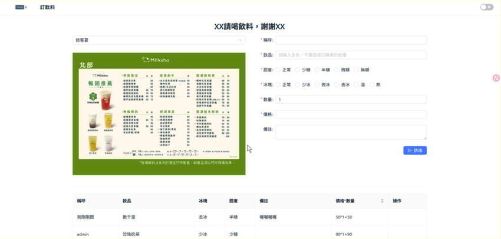

# 訂飲料

說真的，我從來沒想過我會在上班有負責訂飲料的一天，總之就是某天我訂飲料，然後就被臭了ˊ_ˋ。
原本想說找機會跟老大說，看看給不給用，但某天我裝個開發工具就被臭了，說什麼資安問題，我覺得我裝的工具已經是相對安全了，又不是從甚麼神奇的地放下載，這樣都不行，真的是在哭。
那我這個自己寫的，也不能放到USB放到公司電腦，也是要從github下載，我想8成又會被臭，想想還是算了，SB公司一輩子用紙筆吧。

由於上班的環境是在工廠，就是一個甚麼都要申請的環境，不然用google excel就可以了，我也不用再寫一個簡陋版的訂飲料了。本網頁只能訂飲料，都只會顯示當天的飲料而已，不支援顯示查詢歷史紀錄，但可以自己去資料庫查，我怕那些請飲料的人看到自己請的次數，和花了這麼多錢請這些~~廢物~~會受不了。

本專案只適合類似公司、工廠那樣，大家都在同一個網路環境下才可以用

## 程式截圖



## 技術

一切都是在本地運行，使用`rethinkDB`是因為它可以監聯資料庫變化，然後用`socket.io`，傳送消息到前端顯示

- 前端: React 19 + Vite + Ant Design
- 後端: Express 5
- 狀態管理: Zustand
- 即時通訊: `Socket.IO`
- 資料存儲: RethinkDB
- 菜單爬蟲: Python (BeautifulSoup + pdf2image)

## 說明

每個使用者開啟網頁時會自動在 localStorage 產生一組隨機 ID，用來識別訂單是誰建立的，只有建立者本人可以修改或刪除自己的訂單。

管理員可以修改所有人的訂單。成為管理員的方式：**雙擊頁面中央的標題文字**（例如「XX請喝飲料」），輸入正確的管理員密碼即可。管理員身份儲存在 localStorage，關閉頁面後再開啟仍然有效。

## TODO

- [x] 自動爬取最新菜單，目前都需要手動更換(部分有官網的店家可以做到)
- [ ] 可以跟訂飲料的網站連結，一鍵下訂。
  - 靠杯一下某個訂飲料的網站換個分店而已，訂購資料全都要重打什麼大便，氣氣氣~

## 本地啟動

1. clone 本專案，然後執行 `npm i`
2. 調整根目錄的 `.env` 檔案，設定對應的環境變數

   ```env
   REACT_APP_TITLE=XX請喝飲料        # 頁面標題
   REACT_APP_STORE_NAME=迷客夏        # 預設飲料店名稱
   REACT_APP_DISABLED_MENU=false      # 是否禁用菜單切換
   REACT_APP_ADMIN_PASSWORD=你的密碼   # 管理員密碼
   ```

3. 安裝並啟動 [RethinkDB](https://rethinkdb.com/ 'RethinkDB')（用預設設定即可）
4. 執行 `npm start`
5. 用瀏覽器開啟 [http://127.0.0.1:5917](http://127.0.0.1:5917)

> **注意**：`npm start` 時 Vite 會自動將 `.env` 的設定同步到前端，不需要手動修改 `public/env.js`

## Docker說明

1. 在任一目錄建立 `.env` 檔，以下是說明

 環境變數說明

| 變數名稱                        | 說明                               |
| --------------------------- | -------------------------------- |
| **REACT_APP_TITLE**           | 訂飲料頁面標題，例如：XX請喝飲料                |
| **REACT_APP_STORE_NAME**      | 預設飲料店名稱，一定要寫，可用飲料店名稱請看下面的[支援的店家](#支援的店家)                  |
| **REACT_APP_DISABLED_MENU** | 設定菜單是否可以切換，true(禁用)或false(啟用)                   |
| **REACT_APP_ADMIN_PASSWORD** | 管理員密碼，雙擊頁面中央標題輸入此密碼即可成為管理員                   |

2. 在同一目錄下建立 `docker-compose.yaml`，把下面的內容貼上

```yaml
services:
  rethinkdb:
    image: rethinkdb:2.4
    container_name: rethinkdb-order-drink
    volumes:
      - ./rethinkdb-data:/data
    ports:
      - "9000:8080"
      - "28015:28015"
    healthcheck:
      test: ["CMD-SHELL", "curl -f http://localhost:8080 || exit 1"]
      interval: 5s
      retries: 20
      start_period: 5s

  app:
    image: gray9527/order-drink-app:latest
    container_name: order-drink-app
    environment:
      - REACT_APP_TITLE=${REACT_APP_TITLE}
      - REACT_APP_STORE_NAME=${REACT_APP_STORE_NAME}
      - REACT_APP_DISABLED_MENU=${REACT_APP_DISABLED_MENU}
      - REACT_APP_ADMIN_PASSWORD=${REACT_APP_ADMIN_PASSWORD}
      - RETHINKDB_HOST=rethinkdb
    ports:
      - "5918:5918"
    depends_on:
      rethinkdb:
        condition: service_healthy
    restart: unless-stopped
```

3. 執行指令啟動服務（Docker 會自動從 DockerHub 拉取 image）：

```bash
docker compose up -d # 這會把服務另開，不會占用當前窗口
docker compose up # 用當前窗口開啟服務
```

4. 用瀏覽器開啟 [http://localhost:5918](http://localhost:5918)，可以把localhost換成你的`ip`或`電腦名稱`

### 修改設定

修改 `.env` 後需要重啟容器才會生效：

```bash
docker compose down
docker compose up -d
```

> **注意**：`docker compose restart` 不會重新讀取環境變數，必須先 `down` 再 `up` 才行

## npm 與 Docker 的差異

| 模式 | RethinkDB | 啟動方式 | 存取網址 |
| ---- | --------- | ------- | ------- |
| **Docker** | compose 自帶 `rethinkdb-order-drink` | `docker compose up -d` | `http://localhost:5918` |
| **npm 開發** | 手動啟動 `rethinkdb-dev` | `docker start rethinkdb-dev` → `npm start` | `http://127.0.0.1:5917` |

npm 開發模式下有兩個服務：Vite 開發伺服器（port 5917，提供前端頁面 + 熱更新）和 Express 後端（port 5918，API + `Socket.IO`），Vite 會透過 proxy 將 API 請求轉發給 5918，所以只需開 5917。Docker 模式下沒有 Vite，Express 直接提供打包好的靜態檔案，只有 5918 一個 port。

兩者的 RethinkDB 都使用 port 28015，所以切換時需注意：

- 要跑 Docker → 先 `docker stop rethinkdb-dev`
- 要跑 npm → 先 `docker compose down`

## 菜單

### 支援的店家

平常我很少買飲料，不知什麼時候開始有這麼多飲料店...
以`桃園市龍潭區`的飲料店為主，目前的店家有:

- 19(19茶屋)
- 50嵐
- coco
- comebuy
- teatop
- 一沐日
- 五桐號
- 可不可
- 吾奶王
- 大苑子
- 德正
- 清心
- 烏弄
- 珍煮丹
- 萬波
- 迷客夏
- 阿義
- 鮮茶道
- 麻古
- 龜記
- 清原
- 茶湯會
- 雷的茶
- 蔗家店
- 花好月圓
- 福氣塘
- 大茗(大茗本位製茶堂)
- tea(tea's原味)
- 上宇林
- 茶可斯
- 吳家紅茶冰
- 青山

### 菜單爬蟲

部分店家可以做到，有些飲料店官網沒有菜單，只能從其他部分取得，不確定那些地方會不會更新，所以就沒有用爬蟲了，特別紀錄那些不能用爬蟲的特殊店家

**`標題就是官網或圖片連結`**

### [50嵐](http://50lan.com/web/news.asp '50嵐')

從官網來看就是古老的飲料店，網頁還有adobe，菜單還是用doc，有夠怪的

### [COCO](https://supertaste.tvbs.com.tw/food/347016 'COCO')

沒有官網，菜單好像只會放在FB，這個連結是某個部落格的

### [德正](https://dejeng.com/ '德正')

官網做得很漂亮，但沒有菜單圖片阿，這樣再漂亮有G8用

### [清心](https://www.chingshin.tw/ '清心')

有官網，但官網沒有菜單圖片

### [鮮茶道](http://www.presotea.com.tw/ '鮮茶道')

有官網，也有圖片，但我不知道是不是跟https有關，他的官網是http不是https，本地測試正常，但是用github action就會變成下載整個網頁

### [烏弄](https://unocha.com.tw/ '烏弄')

有官網，但沒想到菜單是放在google雲端硬碟，這樣更新的話連結不也是會變

### [龜記](https://guiji-group.com/ '龜記')

有官網，網站做得不錯，但卻沒有菜單圖片可以下載

### [一沐日](https://www.aniceholiday.com.tw/ '一沐日')

不知什麼出現的飲料店，有官網，但菜單不是圖片

### [吾奶王](https://www.facebook.com/wo.milk.king '吾奶王')

不知什麼出現的飲料店，沒有官網，只有FB圖片

### [雷的茶](https://www.facebook.com/photo/?fbid=122099029838788058&set=pb.61573641753788.-2207520000 '雷的茶')

不知什麼出現的飲料店，應該是連鎖店，沒有官網，只有FB圖片

### [蔗家店](https://taiwan.sharelife.tw/article_aid-27007.html '蔗家店')

不知什麼出現的飲料店，應該是連鎖店，沒有官網，只有某個部落圖片

### [福氣塘](https://www.facebook.com/ShiLinhokiTea/ '福氣塘')

不知什麼出現的飲料店，應該是連鎖店，沒有官網，只有FB圖片

### [teas原味](http://www.teas.com.tw/index.php 'teas原味')

感覺應該是規模不小的連鎖店，但我沒印象龍潭有，有官網，但沒有菜單圖片

### [茶可斯](https://order.didieats.com.tw/store/teacos '茶可斯')

聽都沒聯過，又是新的飲料店

### PDF下載圖片

部分店家的菜單是用PDF的，windows要處理pdf還要先裝[poppler](https://github.com/oschwartz10612/poppler-windows 'poppler')，不然不能下載PDF處理後的圖片
~~菜單用PDF都是SB~~

`菜單用PDF的店家:`

- 可不可: 他們網站有擋什麼verify驗證，還我要多做一些事
- 迷客夏: 跟`可不可`比好一點，~~但還是SB~~

## 我測試用

- 修改後測試

```terminal
docker compose build
docker compose up -d
docker compose down
```

- 上傳docker hub

```terminal
# 重新打包image
docker build --no-cache -t gray9527/order-drink-app:latest .
# 上傳
docker push gray9527/order-drink-app:latest
```
